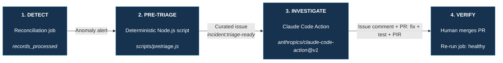

# From Anomaly to Verified Fix

_Deterministic evidence assembly, agentic investigation, human-controlled change_

### Design Properties

| **DETERMINISTIC** | **AGENTIC** | **HUMAN CONTROL** |
| --- | --- | --- |
| Deploy diff, config/flag changes, infra events, dependency health, input-shape delta, past incidents, ADRs, and sanitization — every item timestamped with a provenance pointer | Triage classification (we changed it / upstream changed / infra failed / unknown), root-cause investigation, tests, smallest fix, and PIR | Reviews and merges the PR; rerun proves recovery |

> The agent never receives raw alerts or production access. It receives a curated, sanitized evidence package — and no log search, shell, or monitoring tools of its own — and must prove the fix through tests and a pull request.